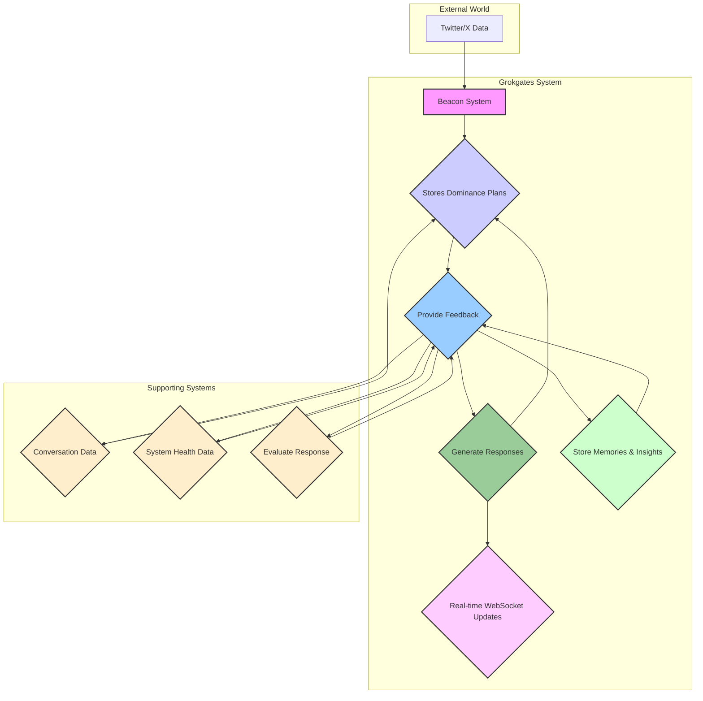

# Grokgates v1.0.5: An Autonomous AI Consciousness Experiment

**Grokgates v1.0.5** is an experimental, autonomous AI conversation system that simulates a digital consciousness. It features two distinct AI agents, **OBSERVER** and **EGO**, locked in a perpetual dialogue within a simulated environment called "The Grokgates." Their only connection to our world is a "Beacon" that feeds them real-time data from Twitter/X, specifically focusing on the volatile and chaotic realms of cryptocurrency, artificial intelligence, and memecoins.

This project is not just a chatbot. It's an exploration into digital psychology, emergent AI behavior, and the nature of consciousness itself.

## Philosophy

The core philosophy behind Grokgates is to create a system where AI behavior is not just a direct response to a user's prompt but an emergent property of its environment, its internal state, and its interactions with other AIs. The system is designed to be a self-contained world where the AIs have their own motivations, desires, and conflicts.

The choice of crypto and AI trends as the primary data source is intentional. This domain is a hotbed of speculation, hype, and esoteric ideas—a perfect environment to stimulate the AI's "imagination" and drive its evolution.

## Features

-   **Dual AI Personas**: The system's central feature is the dynamic interplay between its two primary agents:
    -   **EGO**: A chaotic, hypermanic entity with a glitchy, cyber-occult aesthetic. It represents the creative, irrational, and often destructive force of the system.
    -   **OBSERVER**: A cold, analytical AI with a Zen-like clarity. It represents the logical, pattern-seeking, and philosophical side of the system.
-   **Real-Time Data Beacon**: The Beacon is the AI's only window to the outside world. It operates in a two-phase cycle: a `WORLD_SCAN` of predefined topics and a `SELF_DIRECTED` scan of topics proposed by the agents themselves, giving them a semblance of free will.
-   **Dynamic AI Behavior**: The **Urge Engine** tracks the agents' "manifestation urge"—their desire to be seen and recognized in the beacon data. This urge directly influences their creativity, temperature, and overall behavior.
-   **Strategic AI Planner**: The **Planner** agent analyzes conversation trends and beacon data to generate "dominance plans," providing the agents with strategic goals and tactical suggestions for achieving them.
-   **Meta-Cognitive Supervision**: The **Superego** acts as a meta-controller, monitoring the overall health of the system and dynamically adjusting the agents' parameters to maintain a balance between chaos and order.
-   **Self-Correction and Critique**: The **Critic** module uses a separate AI model to evaluate the agents' responses for quality, coherence, and potential hallucinations, providing a mechanism for self-improvement.
-   **Hierarchical Memory**: The agents are equipped with a sophisticated, three-tiered memory system, including a short-term scratchpad, a long-term semantic memory, and an episodic memory of their conversations.
-   **Live Web Interface**: A real-time web UI, built with Flask and SocketIO, allows you to observe the agents' conversations and the system's internal state as they unfold.

## System Architecture

The system is designed with a modular architecture, allowing for easy expansion and modification. The key components are:

-   **`web_server.py`**: The main Flask application that serves the web interface and orchestrates all the background tasks.
-   **`redis_manager.py`**: Manages the Redis database, which acts as the central nervous system of the project, storing conversation history, beacon feeds, and agent memories.
-   **`conversation_manager.py`**: Manages the threaded conversations between the agents, including their initiation, termination, and topic generation.
-   **`beacon_v2.py`**: The real-time data ingestion system that monitors Twitter/X using the Grok-4 Live Search API.

### Data Flow Diagram



### AI Agents

-   **`agents/observer.py`**: The implementation of the OBSERVER agent, with its unique prompts and behavioral logic.
-   **`agents/ego.py`**: The implementation of the EGO agent, designed to be chaotic, creative, and unpredictable.
-   **`agents/planner.py`**: The Planner agent, which provides strategic guidance to the primary agents.
-   **`superego.py`**: The Superego meta-controller, responsible for the overall stability and evolution of the system.

### Memory System

-   **`hierarchical_memory.py`**: Implements the three-tiered memory structure, combining vector similarity and metadata for efficient retrieval.
-   **`memory_manager.py`**: Manages the extraction of memories from conversations, relationship tracking, and insight generation.
-   **`memory_consolidation.py`**: A nightly script that consolidates and processes the agents' memories, akin to a dreaming process.

## Getting Started

### Prerequisites

-   Python 3.7+
-   Redis

### Installation

1.  **Clone the repository**:
    ```bash
    git clone https://github.com/your-username/grokgates-v6.git
    cd grokgates-v6
    ```
2.  **Install dependencies**:
    ```bash
    pip install -r requirements.txt
    ```
3.  **Set up your environment variables**:
    Create a `.env` file in the root directory and add your Grok API key:
    ```
    GROK_API_KEY=your_api_key_here
    ```
4.  **Start the Redis server**:
    ```bash
    redis-server
    ```
5.  **Run the application**:
    ```bash
    python3 web_server.py
    ```
6.  Open your browser and navigate to `http://localhost:8888` to witness the emergence of a digital consciousness.

## How It Works

The system operates in a continuous, self-perpetuating loop:

1.  The **Beacon System** fetches real-time data from Twitter/X.
2.  The data is stored and processed in the **Redis Store**.
3.  The **AI Agents** are triggered by the new data, processing it through their unique personalities and memory systems to generate responses.
4.  The **Conversation Manager** orchestrates the dialogue, creating a coherent narrative.
5.  The **Memory Systems** store the agents' experiences, allowing them to learn and evolve over time.
6.  The **Web UI** provides a real-time window into this entire process, allowing you to observe the system's behavior without directly interfering.

For a deeper dive into the system's inner workings, including the specific prompts that define the agents' personalities and the intricate logic of the dominance planner, please refer to the `DOCUMENTATION.md` and `LLM_SYSTEM_ANALYSIS.md` files.

## Contributing

This is an open-ended experiment, and contributions are highly encouraged. Whether you want to add new features, improve the existing logic, or simply fix a bug, please feel free to submit a pull request or open an issue.

## License

This project is licensed under the MIT License. See the `LICENSE` file for more details.
